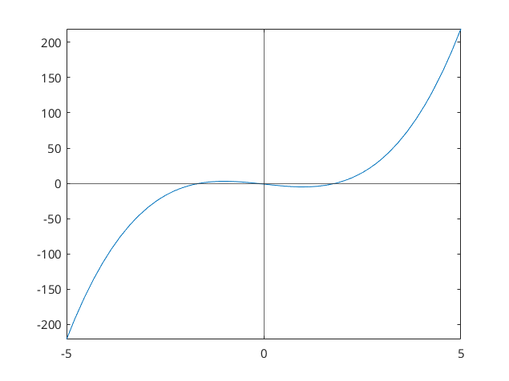
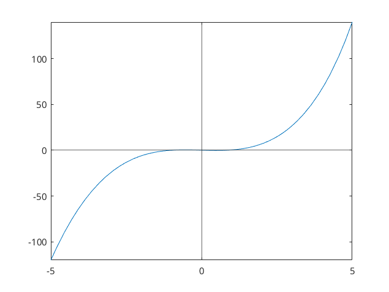
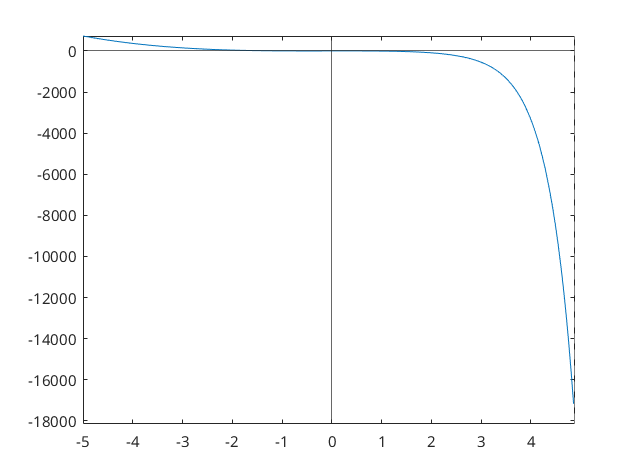

# Chapter 1: Solving equations
## 1.1 The Bisection Method
### Exercises
See bottom of [chapter-1.pdf](chapter-1.pdf).
### Computer problems
#### 1
##### a)
We'll use the interval found for this earlier, $[2,3]$:
```matlab
format long g 
f = @(x) x^3 - 9
a = 2
b = 3
tolerance = 10^-7
bisection(f,a,b,tolerance)
```
Which results in:
```text
ans = 2.08008378744125
```
Which rounds to: $2.080084$

##### b)
```matlab
format long g 
f = @(x) 3*x^3 + x^2 - x - 5
a = 1
b = 2
tolerance = 10^-7
bisection(f,a,b,tolerance)
```
Which results in:
```text
ans = 1.1697261929512
```
Which rounds to: $1.169726$

##### c)
```matlab
format long g 
f = @(x) cos(x)^2 + 6 - x
a = 6
b = 7
tolerance = 10^-7
bisection(f,a,b,tolerance)
```
Which results in:
```text
ans = 6.77609235048294
```
Which rounds to: $6.776092$

#### 2
Skipping these as I never retrieved intervals for them.

#### 3
##### a)
```matlab
f = @(x) 2*x^3 - 6*x - 1
fplot(f) % Using fplot here instead as I couldn't get plot to work.
xline(0) % Add line going through origin (vertical)
yline(0) % Add line going through origin (horizontal)
```
Using this, we get the following plot:


In which, it is clear that the following intervals should work well:
1. $[-2,-1]$
2. $[-0.5, 0.5]$
3. $[1,2]$

Conclusively:
```matlab
format long g 
f = @(x) 2*x^3 - 6*x - 1
pairs = [-2, -1; -0.5, 0.5; 1, 2]
tolerance = 10^-7
bisectionmultiple(f,pairs,tolerance)
```

Resulting in:
```text
ans =

   -1.6417835354805        -0.168254435062408          1.81003791093826
```

##### b)
```matlab
f = @(x) exp(x-2) + x^3 - x
fplot(f) 
xline(0) % Add line going through origin (vertical)
yline(0) % Add line going through origin (horizontal)
```
Using this, we get the following plot:


In which, we can see that the following intervals should work well:
1. $[-1.5,-0.5]$
2. $[-0.5, 0.5]$
3. $[0.5,1.5]$

Conclusively:
```matlab
format long g 
f = @(x) exp(x-2) + x^3 - x
pairs = [-1.5, -0.5; -0.5, 0.5; 0.5, 1.5]
tolerance = 10^-7
bisectionmultiple(f,pairs,tolerance)
```

Resulting in:
```text
ans =

         -1.02348214387894          0.16382223367691         0.788941442966461
```

##### c)
```matlab
f = @(x) 1 + 5*x - 6*x^3 - exp(2*x)
fplot(f) 
xline(0) % Add line going through origin (vertical)
yline(0) % Add line going through origin (horizontal)
```
Using this, we get the following plot:


In which, we can't really see much...

From sneaking a look at the official solutions:
1. $[-1.7, 0.7]$
2. $[-0.7, 0.3]$
3. $[0.3, 1.3]$

Conclusively:
```matlab
format long g 
f = @(x) 1 + 5*x - 6*x^3 - exp(2*x)
pairs = [-1.7, 0.7; -0.7, 0.3; 0.3, 1.3]
tolerance = 10^-7
bisectionmultiple(f,pairs,tolerance)
```

Resulting in:
```text
ans =

        -0.818093752861023     -1.19209289467515e-08         0.506308305263519
```

#### 4
##### a)
There will be two roots, and we can guess some intervals by hand:
1. $[0,2]$
2. $[-2,0]$

Conclusively:
```matlab
format long g 
A = 2
f = @(x) x^2 - A
pairs = [0, 2; -2, 0]
tolerance = 10^-9
bisectionmultiple(f,pairs,tolerance)
```

Resulting in:
```text
ans =

          1.41421356145293         -1.41421356145293
```
##### b)
There will be two roots, and we can guess some intervals by hand:
1. $[0,3]$
2. $[-3,0]$

Conclusively:
```matlab
format long g 
A = 3
f = @(x) x^2 - A
pairs = [0, 3; -3, 0]
tolerance = 10^-9
bisectionmultiple(f,pairs,tolerance)
```

Resulting in:
```text
ans =

          1.73205080791377         -1.73205080791377
```

##### c)
There will be two roots, and we can guess some intervals by hand:
1. $[0,5]$
2. $[-5,0]$

Conclusively:
```matlab
format long g 
A = 5
f = @(x) x^2 - A
pairs = [0, 5; -5, 0]
tolerance = 10^-9
bisectionmultiple(f,pairs,tolerance)
```

Resulting in:
```text
ans =

            2.236067976919           -2.236067976919
```

#### 5
##### a)
There will be one root, and we can naively guess the interval by hand: $[0,2]$

Conclusively:
```matlab
format long g 
A = 2
f = @(x) x^3 - A
a = 0
b = 2
tolerance = 10^-9
bisection(f,a,b,tolerance)
```

Resulting in:
```text
ans =

          1.25992105063051
```
##### b)
There will be one root, and we can naively guess the interval by hand: $[0,3]$

Conclusively:
```matlab
format long g 
A = 3
f = @(x) x^3 - A
a = 0
b = 3
tolerance = 10^-9
bisection(f,a,b,tolerance)
```

Resulting in:
```text
ans =

          1.44224957074039
```

##### c)
There will be one root, and we can naively guess the interval by hand: $[0,5]$

Conclusively:
```matlab
format long g 
A = 5
f = @(x) x^3 - A
a = 0
b = 5
tolerance = 10^-9
bisection(f,a,b,tolerance)
```

Resulting in:
```text
ans =

           1.7099759465782
```
#### 6
```matlab
format long g 
f = @(x) cos(x) - sin(x)
a = 0
b = 1
tolerance = 10^-7
bisection(f,a,b,tolerance)
```
Resulting in:
```text
ans =

         0.785398185253143
```

#### 7
Skipping, seems tedious.

#### 8
Skipping, seems tedious.

#### 9
Skipping, seems tedious.
